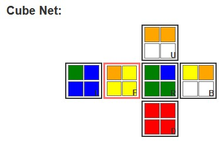

# mitzi-mini-rubik
Towards a 2x2 Rubik's cube solver for Flipper Zero. For now, there is only an HTML-version `solver.htm` which is not yet working.

## Test data
ASCII-notation allows testing and represents the 6 faces (Front, Right, Back, Left, Up, Down) with 4 cells each. 
Try solving `[o,y,y,y],[g,b,g,g],[y,o,w,w],[g,b,b,b],[o,o,w,w],[r,r,r,r]` which looks as follows:

## Version history
See [changelog.md](changelog.md)
